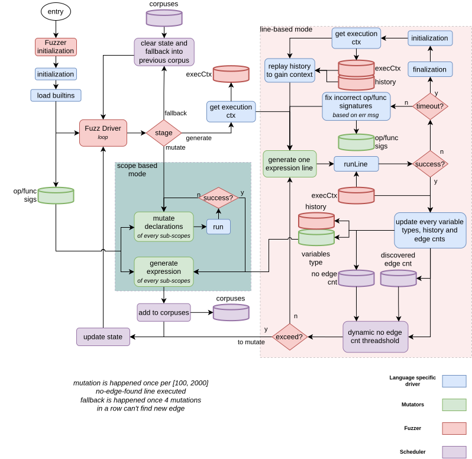

# Grammar fuzzer

Syntax aware token/source codes text mutation based fuzzer.  
*Started in SEFCOM.*

## Features / Contribution

- scope tracking
- declaration and execution statements follow different mutation engines
- adaptive mutation rate
- mutate multiple scope at the same times (attribution problem)
- Higher level general language features support -> e.g. symbol overload (prototype pollution under JS, class-level overload and inherit under Python)
- SandBox-able, iterated scope: e.g. sandbox inner python

## Targets

- CPython
- JavaScript TODO
- LUA TODO
- etc.

## Previous works

- Reflecta
- Nautils

---

## Pipeline

