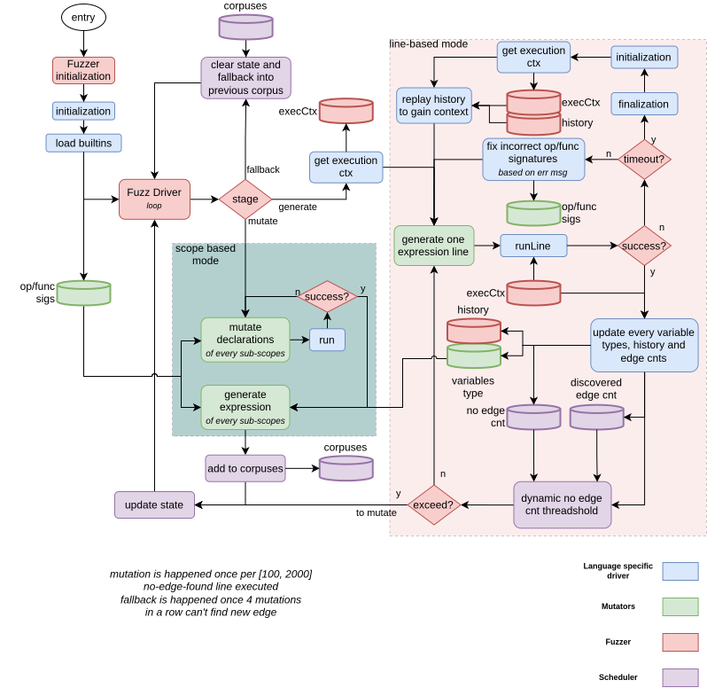

# Grammar fuzzer

Syntax aware token/source codes text mutation based fuzzer.  
*Started in SEFCOM.*

## Targets

- CPython
- LUA
- QuickJS
- TODO

> Notice: driver code of targets other than CPython are mostly maintained by AI

## How to use

- build instructed binary
  1. `nix-shell scripts/cpython-inst.nix`
  2. `./build.sh`
  3. collect builtin info `python3 targets/CPython/builtins.py targets/CPython/builtins.json`
- build coverage binary
  1. `nix-shell scripts/cpython-cov.nix`
  2. `./build_cov.sh`
- run fuzzer `./run.sh`
- after fuzzer terminated, build coverage result
  1. `nix-shell scripts/cpython-cov.nix`
  2. `./run_cov.sh`
  3. draw map `python cov_map.py`(install dependencies by `pip install -r requirements.txt`)

## Features / Contributions

- scope tracking
- declaration and execution statements follow different mutation engines
- adaptive mutation rate
- mutate multiple scope at the same times (attribution problem)
- Higher level general language features support -> e.g. symbol overload (prototype pollution under JS, class-level overload and inherit under Python)
- Fully customized fuzzing framework including TUI, scheduler, mutator and coverage report

## Pipeline



## Previous works

- Reflecta
- Nautils

## Citation

[arXiv: OverrideFuzz: Semantic-Aware Grammar Fuzzing for Script-Runtime Vulnerabilities](https://arxiv.org/abs/2605.12563)
```bibtex
@misc{qiuOverrideFuzzSemanticAwareGrammar2026,
  title = {{{OverrideFuzz}}: {{Semantic-Aware Grammar Fuzzing}} for {{Script-Runtime Vulnerabilities}}},
  shorttitle = {{{OverrideFuzz}}},
  author = {Qiu, Yiran},
  year = 2026,
  month = may,
  number = {arXiv:2605.12563},
  eprint = {2605.12563},
  primaryclass = {cs.CR},
  publisher = {arXiv},
  doi = {10.48550/arXiv.2605.12563},
  abstract = {Script-language runtimes such as Python, Lua, and JavaScript are widely deployed in security sensitive contexts, yet they remain difficult to test because valid inputs must satisfy syntax, dynamic type constraints, and object-level semantics. Existing grammar and reflection-based fuzzers improve syntactic validity and interface reachability, but they rarely model override hooks, dynamic rebinding, and attribute-resolution behavior that can redirect built-in operations across the script-native boundary and trigger use-after-free or type-confusion bugs. We present OverrideFuzz, a two-phase, semantic-aware grammar fuzzer for script-language runtimes. Its declaration phase constructs objects with overriding methods, while its execution phase generates operations that route through those hooks. Active reflection tracks runtime types, and passive reflection learns from error messages to remove invalid operation shapes, allowing generation to approach semantic correctness without manual API specification. We evaluate OverrideFuzz on CPython, Lua, and QuickJS. All three targets show consistent coverage growth, with rapid early expansion followed by slower incremental gains, and Lua benefits most from its pervasive metamethod dispatch mechanism. Although OverrideFuzz did not discover novel vulnerabilities during the bounded evaluation period, corpus analysis shows that it reconstructs inputs matching known vulnerability patterns, which suggests that semantic-aware generation reaches the intended script-native boundary behaviors.},
  archiveprefix = {arXiv},
}
```
